# AMR Labs 1 and 2 - ROS 2 and Turtlebot 4

- Source: `C:\Users\1213d\Downloads\AMR_LAB_1_2.pdf`
- Pages: 59

> Each page image is the visual source of truth. Extracted PDF text is included for search and analysis, but slide animations and handwritten pages may produce imperfect text order.

## Pages

[Page 1](#page-1) | [Page 2](#page-2) | [Page 3](#page-3) | [Page 4](#page-4) | [Page 5](#page-5) | [Page 6](#page-6) | [Page 7](#page-7) | [Page 8](#page-8) | [Page 9](#page-9) | [Page 10](#page-10) | [Page 11](#page-11) | [Page 12](#page-12) | [Page 13](#page-13) | [Page 14](#page-14) | [Page 15](#page-15) | [Page 16](#page-16) | [Page 17](#page-17) | [Page 18](#page-18) | [Page 19](#page-19) | [Page 20](#page-20) | [Page 21](#page-21) | [Page 22](#page-22) | [Page 23](#page-23) | [Page 24](#page-24) | [Page 25](#page-25) | [Page 26](#page-26) | [Page 27](#page-27) | [Page 28](#page-28) | [Page 29](#page-29) | [Page 30](#page-30) | [Page 31](#page-31) | [Page 32](#page-32) | [Page 33](#page-33) | [Page 34](#page-34) | [Page 35](#page-35) | [Page 36](#page-36) | [Page 37](#page-37) | [Page 38](#page-38) | [Page 39](#page-39) | [Page 40](#page-40) | [Page 41](#page-41) | [Page 42](#page-42) | [Page 43](#page-43) | [Page 44](#page-44) | [Page 45](#page-45) | [Page 46](#page-46) | [Page 47](#page-47) | [Page 48](#page-48) | [Page 49](#page-49) | [Page 50](#page-50) | [Page 51](#page-51) | [Page 52](#page-52) | [Page 53](#page-53) | [Page 54](#page-54) | [Page 55](#page-55) | [Page 56](#page-56) | [Page 57](#page-57) | [Page 58](#page-58) | [Page 59](#page-59)

<a id="page-1"></a>
## Page 1

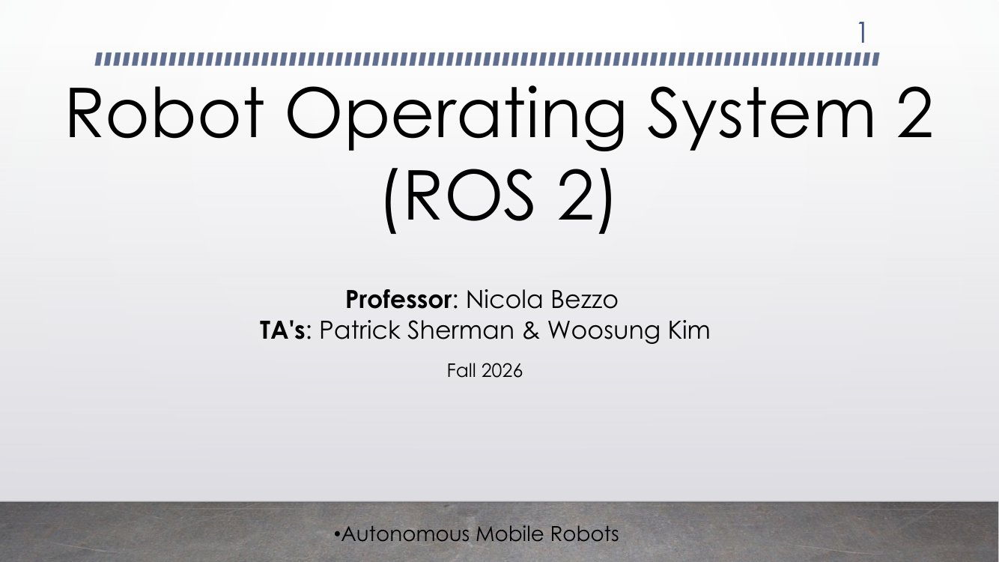

<details>
<summary>Extracted text</summary>

```text
1
Robot Operating System 2
(ROS 2)
Professor: Nicola Bezzo
TA's: Patrick Sherman & Woosung Kim
Fall 2026
•Autonomous Mobile Robots
```

</details>

<a id="page-2"></a>
## Page 2

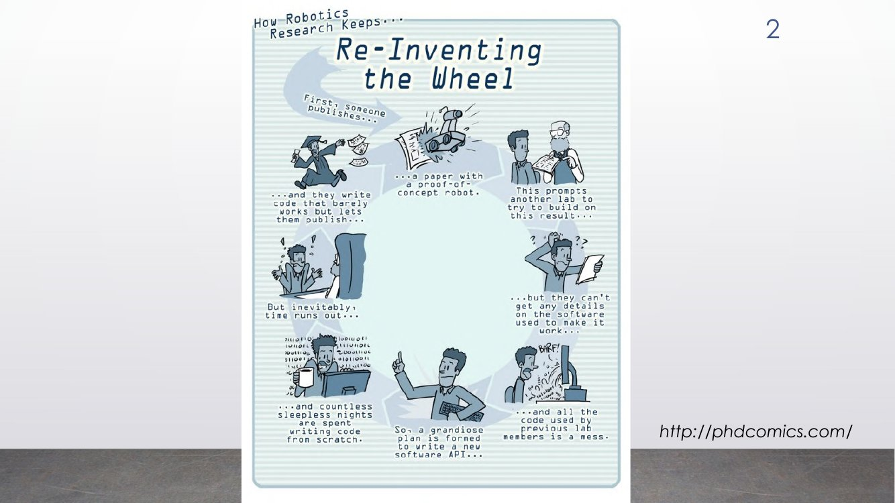

<details>
<summary>Extracted text</summary>

```text
2
http://phdcomics.com/
```

</details>

<a id="page-3"></a>
## Page 3

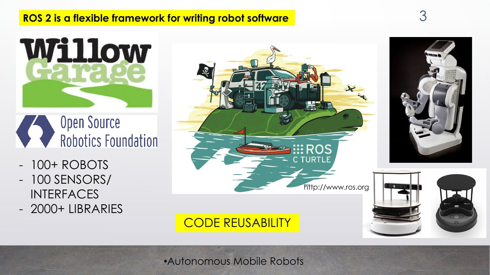

<details>
<summary>Extracted text</summary>

```text
3
ROS 2 is a flexible framework for writing robot software
- 100+ ROBOTS
- 100 SENSORS/
http://www.ros.org
INTERFACES
- 2000+ LIBRARIES
CODE REUSABILITY
•Autonomous Mobile Robots
```

</details>

<a id="page-4"></a>
## Page 4

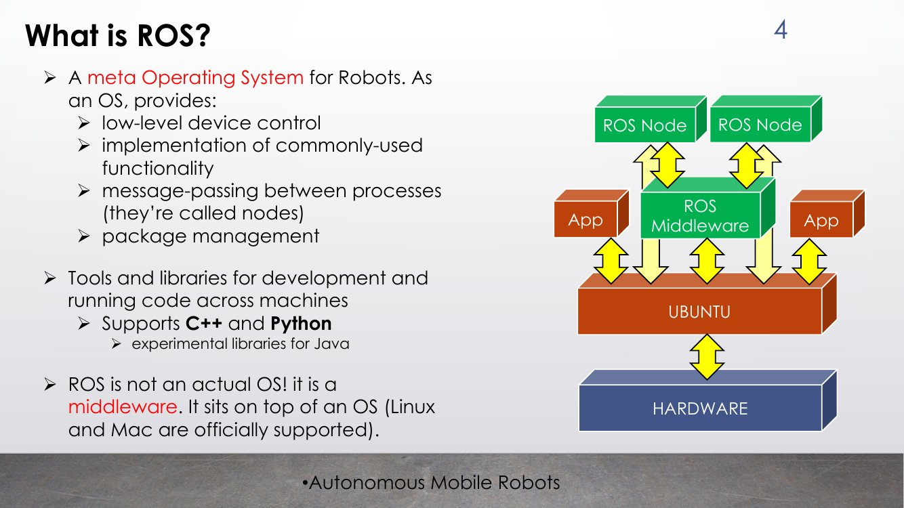

<details>
<summary>Extracted text</summary>

```text
4
What is ROS?
Ø A meta Operating System for Robots. As
an OS, provides:
Ø low-level device control
ROS Node ROS Node
Ø implementation of commonly-used
functionality
Ø message-passing between processes
ROS
(they’re called nodes)
App App
Middleware
Ø package management
Ø Tools and libraries for development and
running code across machines
UBUNTU
Ø Supports C++ and Python
Ø experimental libraries for Java
Ø ROS is not an actual OS! it is a
middleware. It sits on top of an OS (Linux HARDWARE
and Mac are officially supported).
•Autonomous Mobile Robots
```

</details>

<a id="page-5"></a>
## Page 5

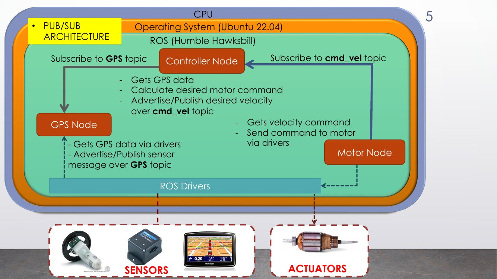

<details>
<summary>Extracted text</summary>

```text
CPU 5
• PUB/SUB Operating System (Ubuntu 22.04)
ARCHITECTURE
ROS (Humble Hawksbill)
Subscribe to GPS topic Subscribe to cmd_vel topic
Controller Node
- Gets GPS data
- Calculate desired motor command
- Advertise/Publish desired velocity
over cmd_vel topic
- Gets velocity command
GPS Node
- Send command to motor
- Gets GPS data via drivers via drivers
Motor Node
- Advertise/Publish sensor
message over GPS topic
ROS Drivers
SENSORS ACTUATORS
```

</details>

<a id="page-6"></a>
## Page 6

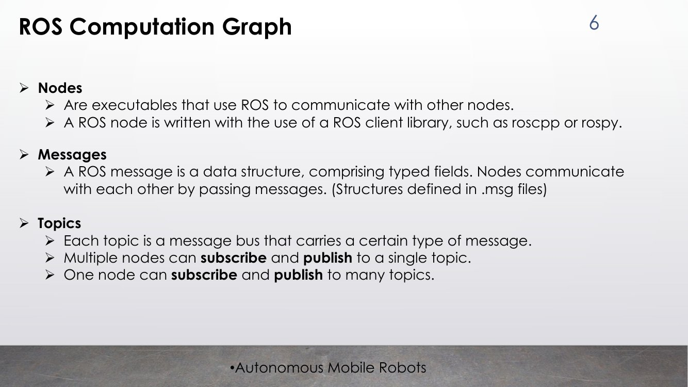

<details>
<summary>Extracted text</summary>

```text
6
ROS Computation Graph
Ø Nodes
Ø Are executables that use ROS to communicate with other nodes.
Ø A ROS node is written with the use of a ROS client library, such as roscpp or rospy.
Ø Messages
Ø A ROS message is a data structure, comprising typed fields. Nodes communicate
with each other by passing messages. (Structures defined in .msg files)
Ø Topics
Ø Each topic is a message bus that carries a certain type of message.
Ø Multiple nodes can subscribe and publish to a single topic.
Ø One node can subscribe and publish to many topics.
•Autonomous Mobile Robots
```

</details>

<a id="page-7"></a>
## Page 7

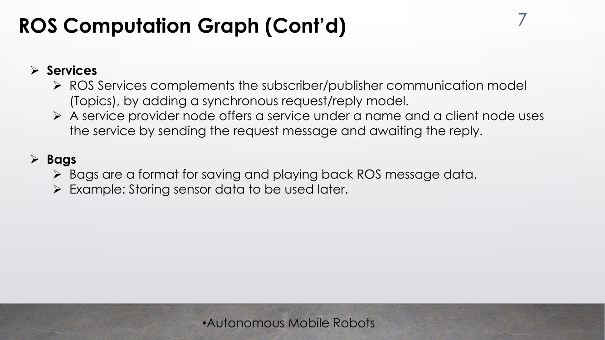

<details>
<summary>Extracted text</summary>

```text
7
ROS Computation Graph (Cont’d)
Ø Services
Ø ROS Services complements the subscriber/publisher communication model
(Topics), by adding a synchronous request/reply model.
Ø A service provider node offers a service under a name and a client node uses
the service by sending the request message and awaiting the reply.
Ø Bags
Ø Bags are a format for saving and playing back ROS message data.
Ø Example: Storing sensor data to be used later.
•Autonomous Mobile Robots
```

</details>

<a id="page-8"></a>
## Page 8

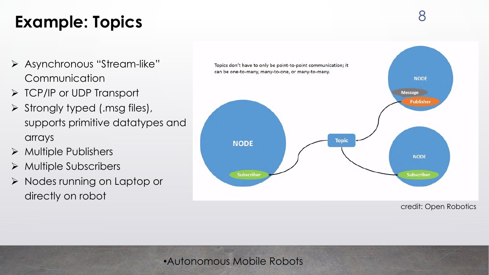

<details>
<summary>Extracted text</summary>

```text
8
Example: Topics
Ø Asynchronous “Stream-like”
Communication
Ø TCP/IP or UDP Transport
Ø Strongly typed (.msg files),
supports primitive datatypes and
arrays
Ø Multiple Publishers
Ø Multiple Subscribers
Ø Nodes running on Laptop or
directly on robot
credit: Open Robotics
•Autonomous Mobile Robots
```

</details>

<a id="page-9"></a>
## Page 9

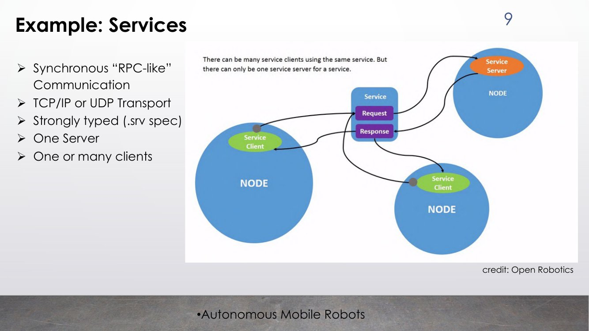

<details>
<summary>Extracted text</summary>

```text
9
Example: Services
Ø Synchronous “RPC-like”
Communication
Ø TCP/IP or UDP Transport
Ø Strongly typed (.srv spec)
Ø One Server
Ø One or many clients
credit: Open Robotics
•Autonomous Mobile Robots
```

</details>

<a id="page-10"></a>
## Page 10


<details>
<summary>Extracted text</summary>

```text
10
OPEN YOUR BOX
•Autonomous Mobile Robots
```

</details>

<a id="page-11"></a>
## Page 11

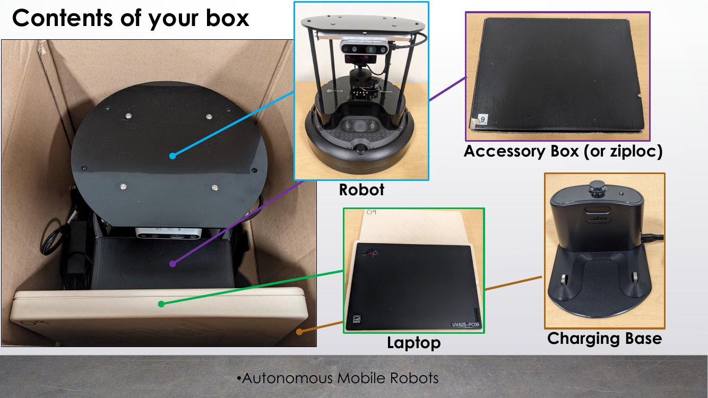

<details>
<summary>Extracted text</summary>

```text
Contents of your box
11
Accessory Box (or ziploc)
Robot
Charging Base
Laptop
•Autonomous Mobile Robots
```

</details>

<a id="page-12"></a>
## Page 12

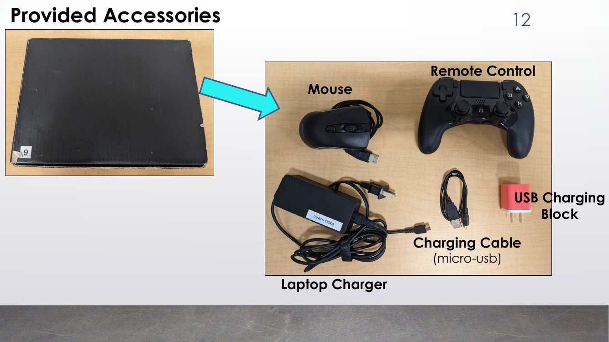

<details>
<summary>Extracted text</summary>

```text
Provided Accessories
12
Remote Control
Mouse
USB Charging
Block
Charging Cable
(micro-usb)
Laptop Charger
```

</details>

<a id="page-13"></a>
## Page 13

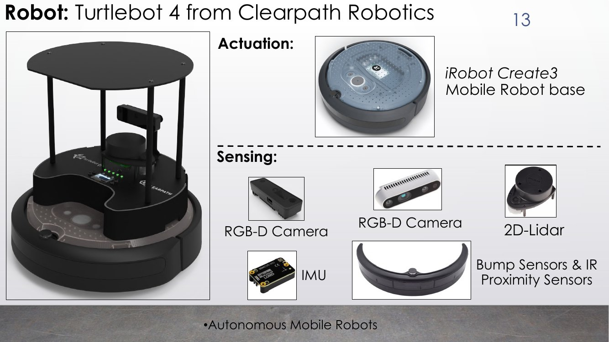

<details>
<summary>Extracted text</summary>

```text
Robot: Turtlebot 4 from Clearpath Robotics
13
Actuation:
iRobot Create3
Mobile Robot base
Sensing:
RGB-D Camera
RGB-D Camera 2D-Lidar
Bump Sensors & IR
IMU
Proximity Sensors
•Autonomous Mobile Robots
```

</details>

<a id="page-14"></a>
## Page 14

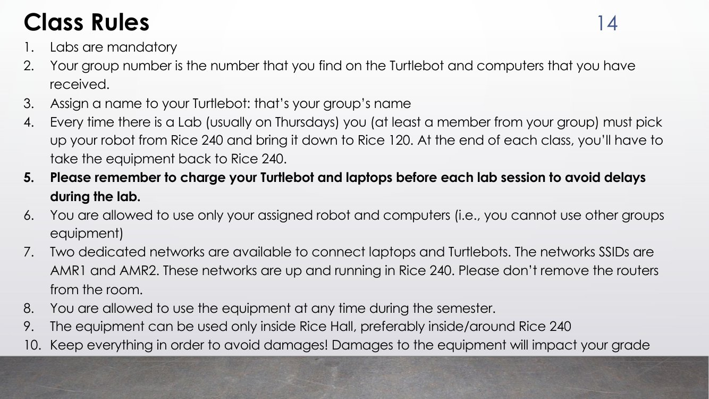

<details>
<summary>Extracted text</summary>

```text
Class Rules
14
1. Labs are mandatory
2. Your group number is the number that you find on the Turtlebot and computers that you have
received.
3. Assign a name to your Turtlebot: that’s your group’s name
4. Every time there is a Lab (usually on Thursdays) you (at least a member from your group) must pick
up your robot from Rice 240 and bring it down to Rice 120. At the end of each class, you’ll have to
take the equipment back to Rice 240.
5. Please remember to charge your Turtlebot and laptops before each lab session to avoid delays
during the lab.
6. You are allowed to use only your assigned robot and computers (i.e., you cannot use other groups
equipment)
7. Two dedicated networks are available to connect laptops and Turtlebots. The networks SSIDs are
AMR1 and AMR2. These networks are up and running in Rice 240. Please don’t remove the routers
from the room.
8. You are allowed to use the equipment at any time during the semester.
9. The equipment can be used only inside Rice Hall, preferably inside/around Rice 240
10. Keep everything in order to avoid damages! Damages to the equipment will impact your grade
```

</details>

<a id="page-15"></a>
## Page 15

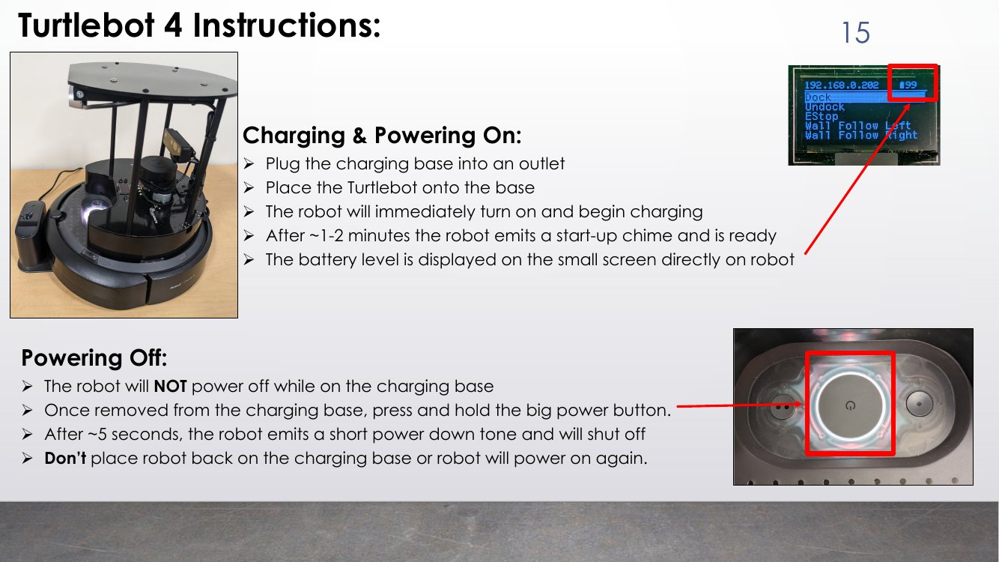

<details>
<summary>Extracted text</summary>

```text
Turtlebot 4 Instructions:
15
Charging & Powering On:
Ø Plug the charging base into an outlet
Ø Place the Turtlebot onto the base
Ø The robot will immediately turn on and begin charging
Ø After ~1-2 minutes the robot emits a start-up chime and is ready
Ø The battery level is displayed on the small screen directly on robot
Powering Off:
Ø The robot will NOT power off while on the charging base
Ø Once removed from the charging base, press and hold the big power button.
Ø After ~5 seconds, the robot emits a short power down tone and will shut off
Ø Don’t place robot back on the charging base or robot will power on again.
```

</details>

<a id="page-16"></a>
## Page 16

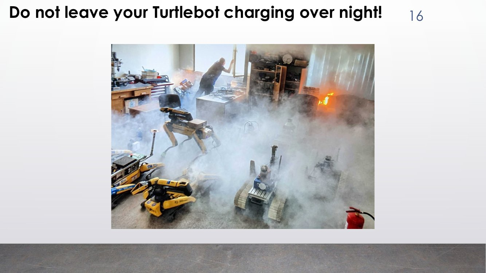

<details>
<summary>Extracted text</summary>

```text
Do not leave your Turtlebot charging over night!
16
```

</details>

<a id="page-17"></a>
## Page 17

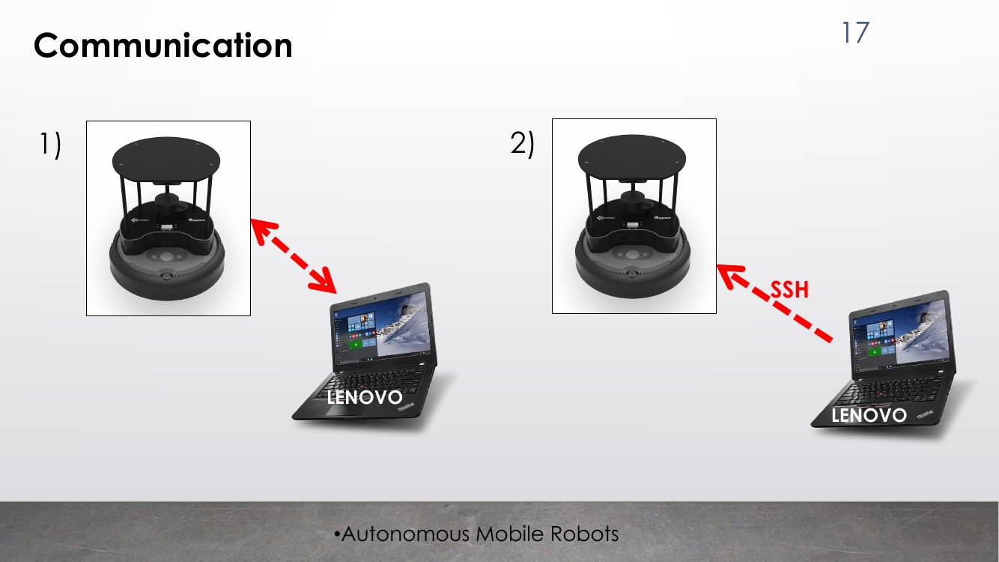

<details>
<summary>Extracted text</summary>

```text
17
Communication
1) 2)
SSH
LENOVO
•Autonomous Mobile Robots
```

</details>

<a id="page-18"></a>
## Page 18

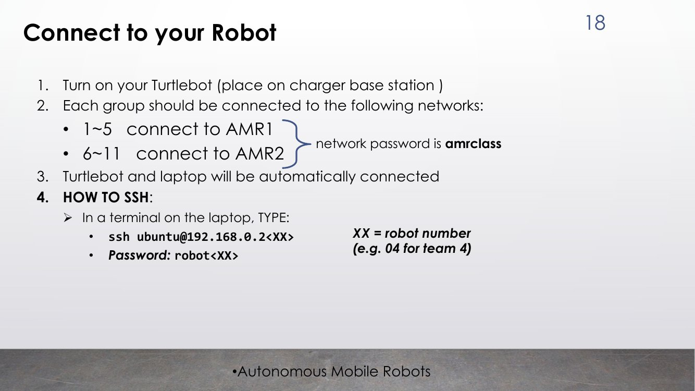

<details>
<summary>Extracted text</summary>

```text
18
Connect to your Robot
1. Turn on your Turtlebot (place on charger base station )
2. Each group should be connected to the following networks:
• 1~5 connect to AMR1
network password is amrclass
• 6~11 connect to AMR2
3. Turtlebot and laptop will be automatically connected
4. HOW TO SSH:
Ø In a terminal on the laptop, TYPE:
XX = robot number
• ssh ubuntu@192.168.0.2<XX>
(e.g. 04 for team 4)
• Password: robot<XX>
•Autonomous Mobile Robots
```

</details>

<a id="page-19"></a>
## Page 19

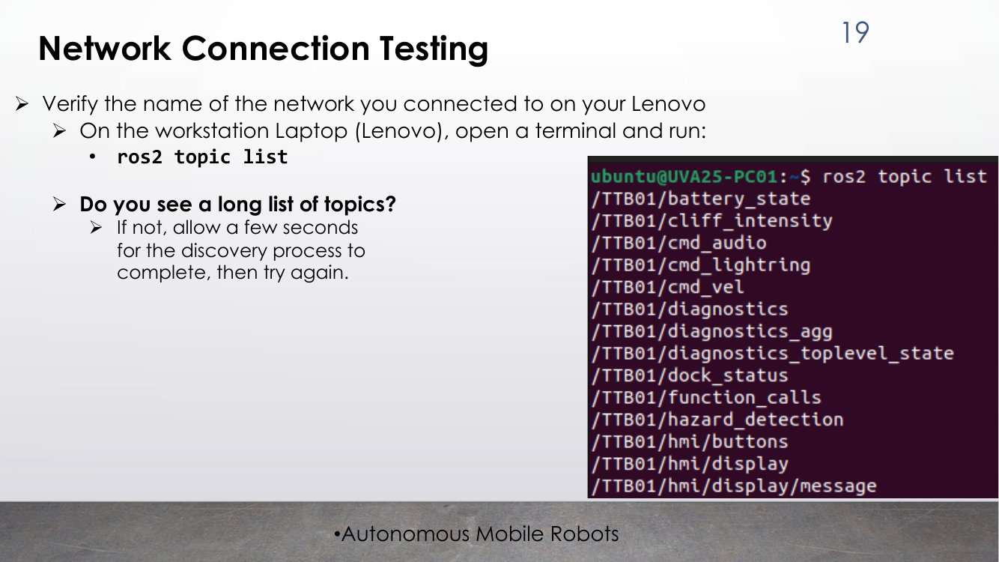

<details>
<summary>Extracted text</summary>

```text
19
Network Connection Testing
Ø Verify the name of the network you connected to on your Lenovo
Ø On the workstation Laptop (Lenovo), open a terminal and run:
• ros2 topic list
Ø Do you see a long list of topics?
Ø If not, allow a few seconds
for the discovery process to
complete, then try again.
•Autonomous Mobile Robots
```

</details>

<a id="page-20"></a>
## Page 20

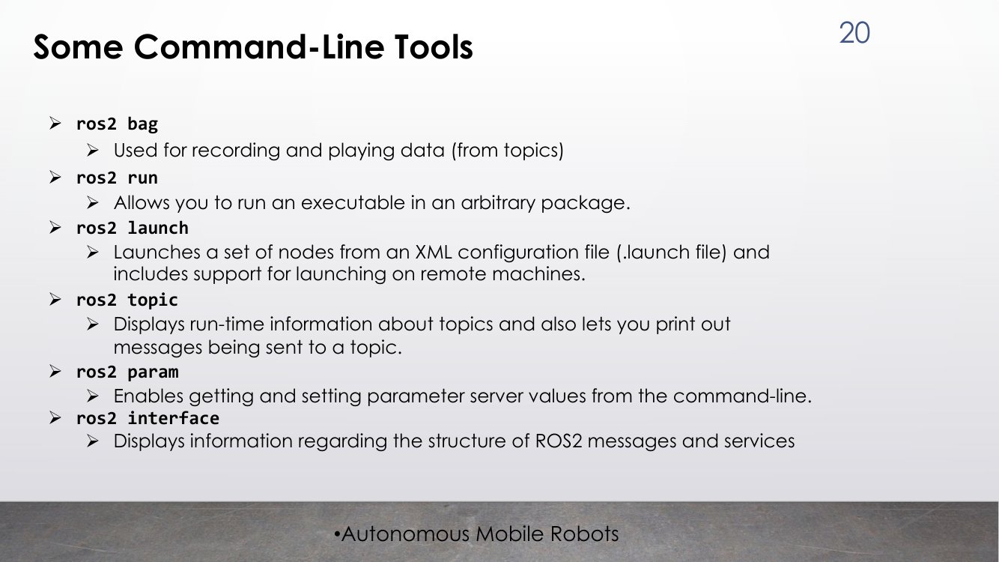

<details>
<summary>Extracted text</summary>

```text
20
Some Command-Line Tools
Ø ros2 bag
Ø Used for recording and playing data (from topics)
Ø ros2 run
Ø Allows you to run an executable in an arbitrary package.
Ø ros2 launch
Ø Launches a set of nodes from an XML configuration file (.launch file) and
includes support for launching on remote machines.
Ø ros2 topic
Ø Displays run-time information about topics and also lets you print out
messages being sent to a topic.
Ø ros2 param
Ø Enables getting and setting parameter server values from the command-line.
Ø ros2 interface
Ø Displays information regarding the structure of ROS2 messages and services
•Autonomous Mobile Robots
```

</details>

<a id="page-21"></a>
## Page 21

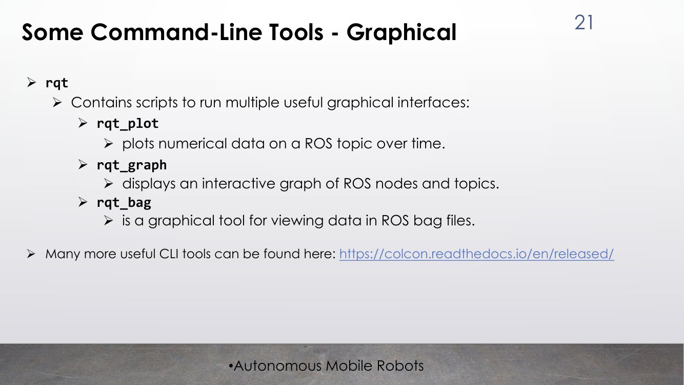

<details>
<summary>Extracted text</summary>

```text
21
Some Command-Line Tools - Graphical
Ø rqt
Ø Contains scripts to run multiple useful graphical interfaces:
Ø rqt_plot
Ø plots numerical data on a ROS topic over time.
Ø rqt_graph
Ø displays an interactive graph of ROS nodes and topics.
Ø rqt_bag
Ø is a graphical tool for viewing data in ROS bag files.
Ø Many more useful CLI tools can be found here: https://colcon.readthedocs.io/en/released/
•Autonomous Mobile Robots
```

</details>

<a id="page-22"></a>
## Page 22

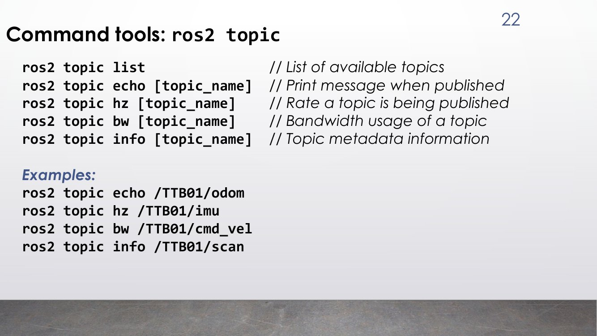

<details>
<summary>Extracted text</summary>

```text
22
Command tools: ros2 topic
ros2 topic list // List of available topics
ros2 topic echo [topic_name] // Print message when published
ros2 topic hz [topic_name] // Rate a topic is being published
ros2 topic bw [topic_name] // Bandwidth usage of a topic
ros2 topic info [topic_name] // Topic metadata information
Examples:
ros2 topic echo /TTB01/odom
ros2 topic hz /TTB01/imu
ros2 topic bw /TTB01/cmd_vel
ros2 topic info /TTB01/scan
```

</details>

<a id="page-23"></a>
## Page 23

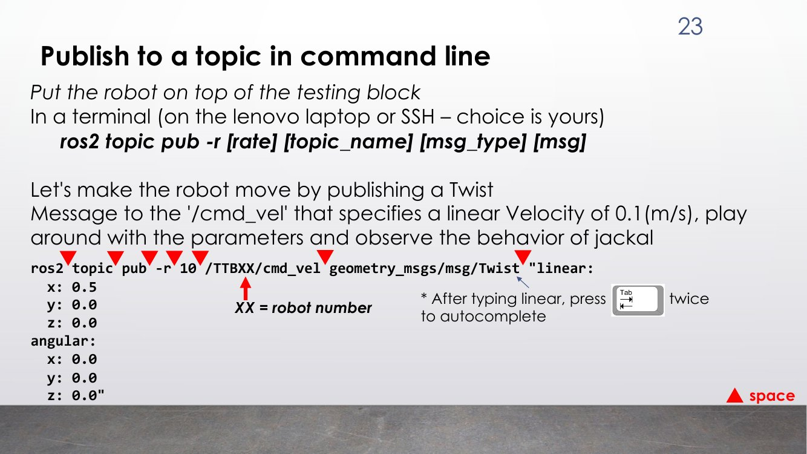

<details>
<summary>Extracted text</summary>

```text
23
Publish to a topic in command line
Put the robot on top of the testing block
In a terminal (on the lenovo laptop or SSH – choice is yours)
ros2 topic pub -r [rate] [topic_name] [msg_type] [msg]
Let's make the robot move by publishing a Twist
Message to the '/cmd_vel' that specifies a linear Velocity of 0.1(m/s), play
around with the parameters and observe the behavior of jackal
ros2 topic pub -r 10 /TTBXX/cmd_vel geometry_msgs/msg/Twist "linear:
x: 0.5
* After typing linear, press twice
y: 0.0
XX = robot number
to autocomplete
z: 0.0
angular:
x: 0.0
y: 0.0
z: 0.0" space
```

</details>

<a id="page-24"></a>
## Page 24

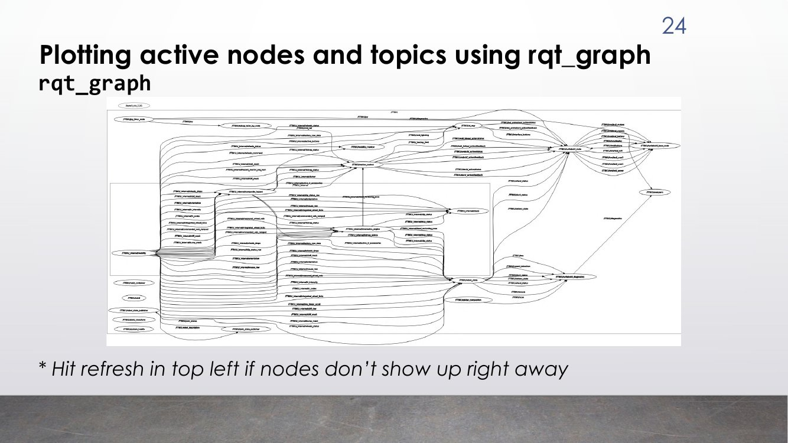

<details>
<summary>Extracted text</summary>

```text
24
Plotting active nodes and topics using rqt_graph
rqt_graph
* Hit refresh in top left if nodes don’t show up right away
```

</details>

<a id="page-25"></a>
## Page 25

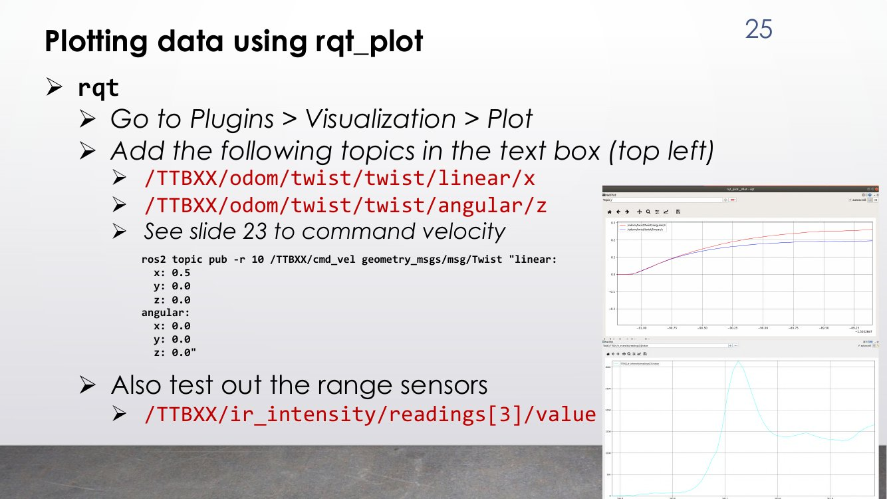

<details>
<summary>Extracted text</summary>

```text
25
Plotting data using rqt_plot
Ø rqt
Ø Go to Plugins > Visualization > Plot
Ø Add the following topics in the text box (top left)
Ø /TTBXX/odom/twist/twist/linear/x
Ø /TTBXX/odom/twist/twist/angular/z
Ø See slide 23 to command velocity
ros2 topic pub -r 10 /TTBXX/cmd_vel geometry_msgs/msg/Twist "linear:
x: 0.5
y: 0.0
z: 0.0
angular:
x: 0.0
y: 0.0
z: 0.0"
Ø Also test out the range sensors
Ø /TTBXX/ir_intensity/readings[3]/value
```

</details>

<a id="page-26"></a>
## Page 26

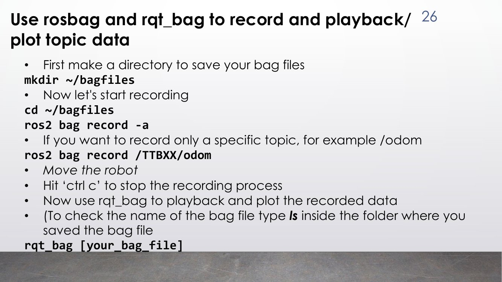

<details>
<summary>Extracted text</summary>

```text
26
Use rosbag and rqt_bag to record and playback/
plot topic data
• First make a directory to save your bag files
mkdir ~/bagfiles
• Now let's start recording
cd ~/bagfiles
ros2 bag record -a
• If you want to record only a specific topic, for example /odom
ros2 bag record /TTBXX/odom
• Move the robot
• Hit ‘ctrl c’ to stop the recording process
• Now use rqt_bag to playback and plot the recorded data
• (To check the name of the bag file type ls inside the folder where you
saved the bag file
rqt_bag [your_bag_file]
```

</details>

<a id="page-27"></a>
## Page 27

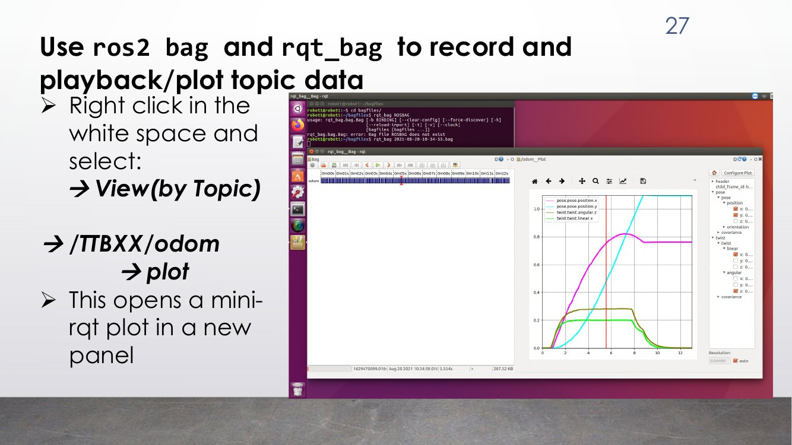

<details>
<summary>Extracted text</summary>

```text
27
Use ros2 bag and rqt_bag to record and
playback/plot topic data
Ø Right click in the
white space and
select:
à View(by Topic)
à/TTBXX/odom
à plot
Ø This opens a mini-
rqt plot in a new
panel
```

</details>

<a id="page-28"></a>
## Page 28

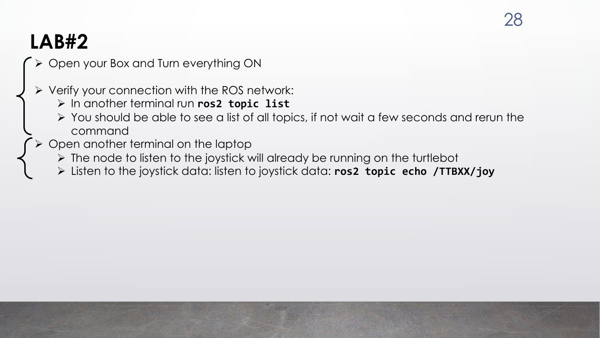

<details>
<summary>Extracted text</summary>

```text
28
LAB#2
Ø Open your Box and Turn everything ON
Ø Verify your connection with the ROS network:
Ø In another terminal run ros2 topic list
Ø You should be able to see a list of all topics, if not wait a few seconds and rerun the
command
Ø Open another terminal on the laptop
Ø The node to listen to the joystick will already be running on the turtlebot
Ø Listen to the joystick data: listen to joystick data: ros2 topic echo /TTBXX/joy
```

</details>

<a id="page-29"></a>
## Page 29

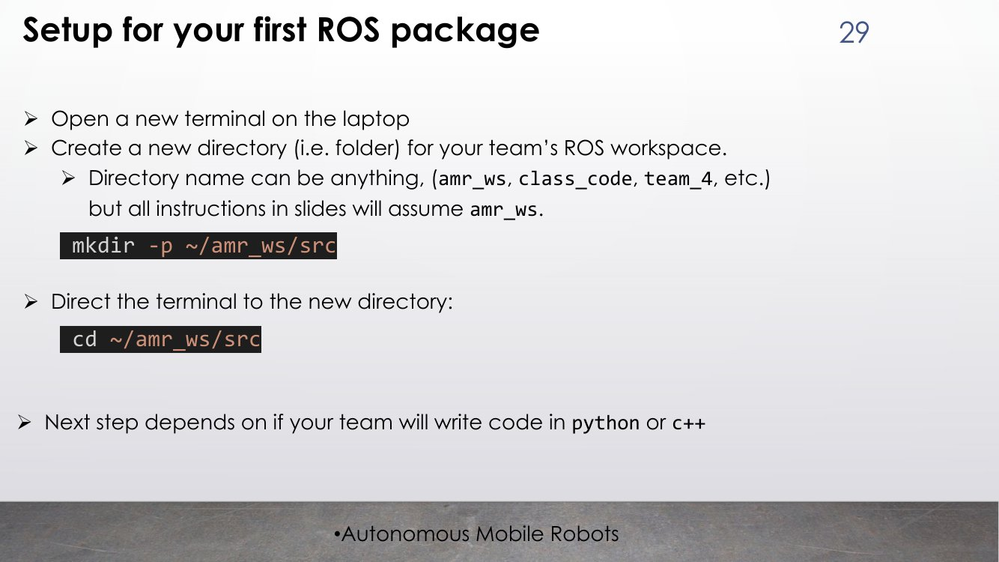

<details>
<summary>Extracted text</summary>

```text
Setup for your first ROS package
29
Ø Open a new terminal on the laptop
Ø Create a new directory (i.e. folder) for your team’s ROS workspace.
Ø Directory name can be anything, (amr_ws, class_code, team_4, etc.)
but all instructions in slides will assume amr_ws.
mkdir -p ~/amr_ws/src
Ø Direct the terminal to the new directory:
cd ~/amr_ws/src
Ø Next step depends on if your team will write code in python or c++
•Autonomous Mobile Robots
```

</details>

<a id="page-30"></a>
## Page 30

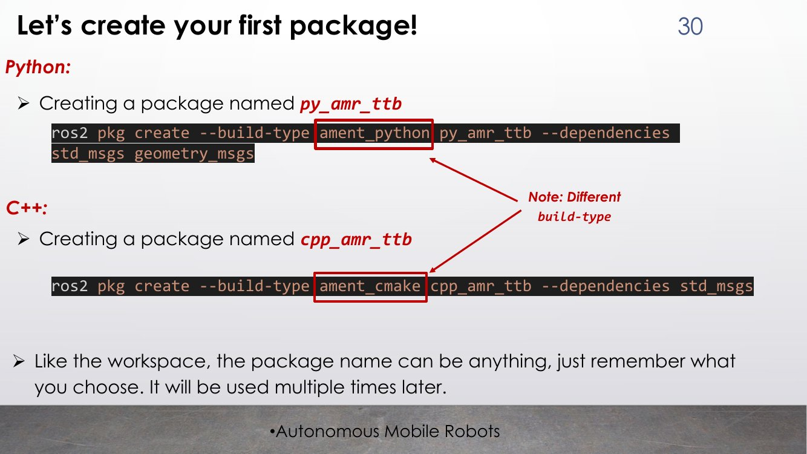

<details>
<summary>Extracted text</summary>

```text
Let’s create your first package!
30
Python:
Ø Creating a package named py_amr_ttb
ros2 pkg create --build-type ament_python py_amr_ttb --dependencies
std_msgs geometry_msgs
Note: Different
C++:
build-type
Ø Creating a package named cpp_amr_ttb
ros2 pkg create --build-type ament_cmake cpp_amr_ttb --dependencies std_msgs
Ø Like the workspace, the package name can be anything, just remember what
you choose. It will be used multiple times later.
•Autonomous Mobile Robots
```

</details>

<a id="page-31"></a>
## Page 31

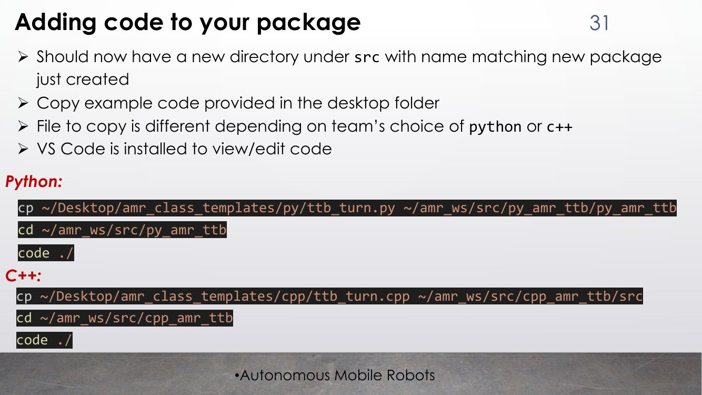

<details>
<summary>Extracted text</summary>

```text
Adding code to your package
31
Ø Should now have a new directory under src with name matching new package
just created
Ø Copy example code provided in the desktop folder
Ø File to copy is different depending on team’s choice of python or c++
Ø VS Code is installed to view/edit code
Python:
cp ~/Desktop/amr_class_templates/py/ttb_turn.py ~/amr_ws/src/py_amr_ttb/py_amr_ttb
cd ~/amr_ws/src/py_amr_ttb
code ./
C++:
cp ~/Desktop/amr_class_templates/cpp/ttb_turn.cpp ~/amr_ws/src/cpp_amr_ttb/src
cd ~/amr_ws/src/cpp_amr_ttb
code ./
•Autonomous Mobile Robots
```

</details>

<a id="page-32"></a>
## Page 32

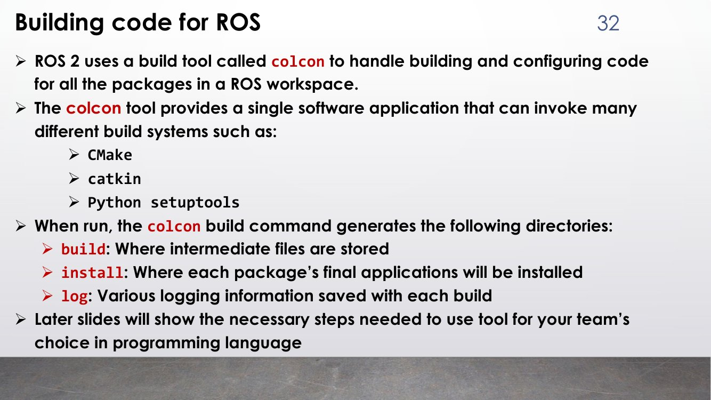

<details>
<summary>Extracted text</summary>

```text
Building code for ROS
32
Ø ROS 2 uses a build tool called colcon to handle building and configuring code
for all the packages in a ROS workspace.
Ø The colcon tool provides a single software application that can invoke many
different build systems such as:
Ø CMake
Ø catkin
Ø Python setuptools
Ø When run, the colcon build command generates the following directories:
Ø build: Where intermediate files are stored
Ø install: Where each package’s final applications will be installed
Ø log: Various logging information saved with each build
Ø Later slides will show the necessary steps needed to use tool for your team’s
choice in programming language
```

</details>

<a id="page-33"></a>
## Page 33

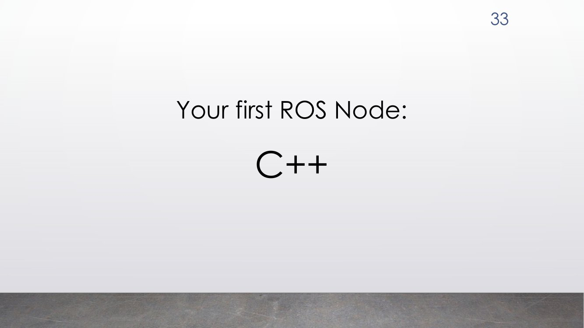

<details>
<summary>Extracted text</summary>

```text
33
Your first ROS Node:
C++
```

</details>

<a id="page-34"></a>
## Page 34

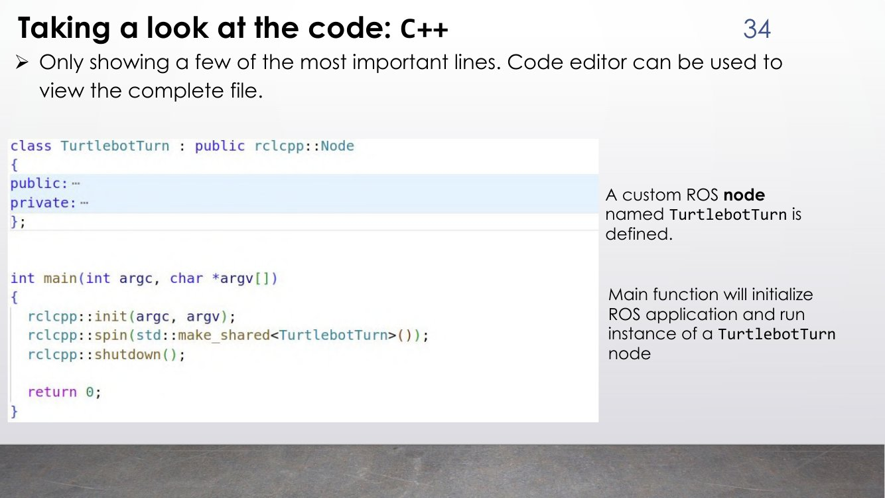

<details>
<summary>Extracted text</summary>

```text
Taking a look at the code: C++ 34
Ø Only showing a few of the most important lines. Code editor can be used to
view the complete file.
A custom ROS node
named TurtlebotTurn is
defined.
Main function will initialize
ROS application and run
instance of a TurtlebotTurn
node
```

</details>

<a id="page-35"></a>
## Page 35

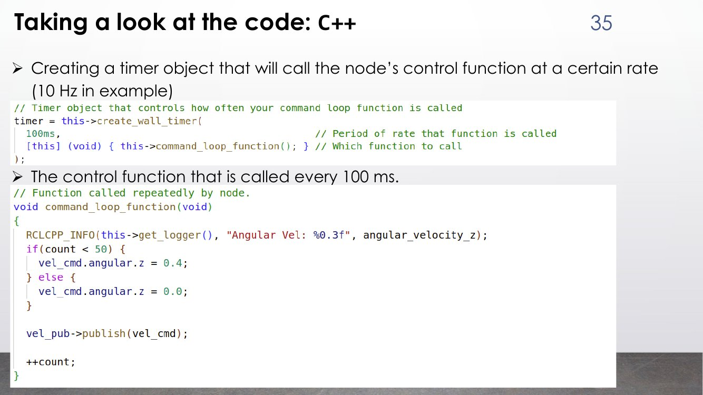

<details>
<summary>Extracted text</summary>

```text
Taking a look at the code: C++ 35
Ø Creating a timer object that will call the node’s control function at a certain rate
(10 Hz in example)
Ø The control function that is called every 100 ms.
```

</details>

<a id="page-36"></a>
## Page 36

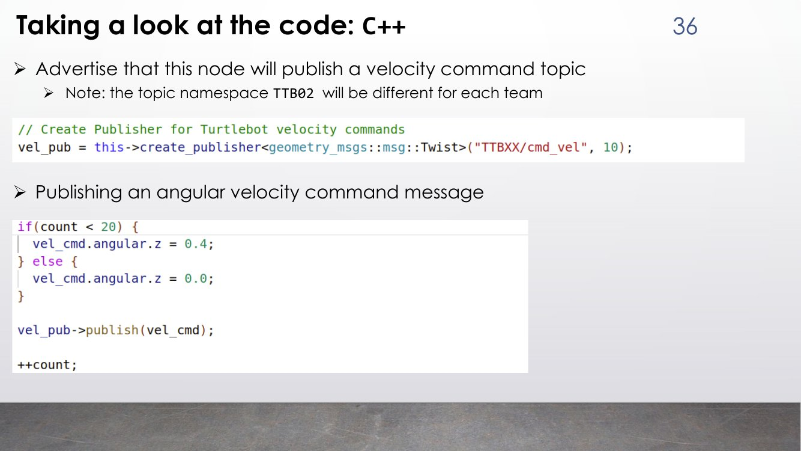

<details>
<summary>Extracted text</summary>

```text
Taking a look at the code: C++ 36
Ø Advertise that this node will publish a velocity command topic
Ø Note: the topic namespace TTB02 will be different for each team
Ø Publishing an angular velocity command message
```

</details>

<a id="page-37"></a>
## Page 37

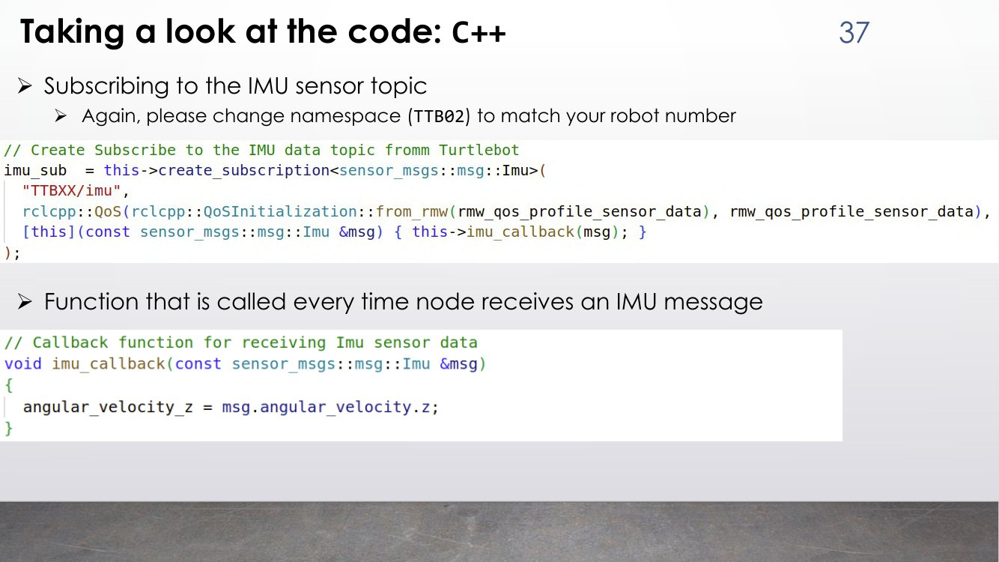

<details>
<summary>Extracted text</summary>

```text
Taking a look at the code: C++ 37
Ø Subscribing to the IMU sensor topic
Ø Again, please change namespace (TTB02) to match your robot number
Ø Function that is called every time node receives an IMU message
```

</details>

<a id="page-38"></a>
## Page 38

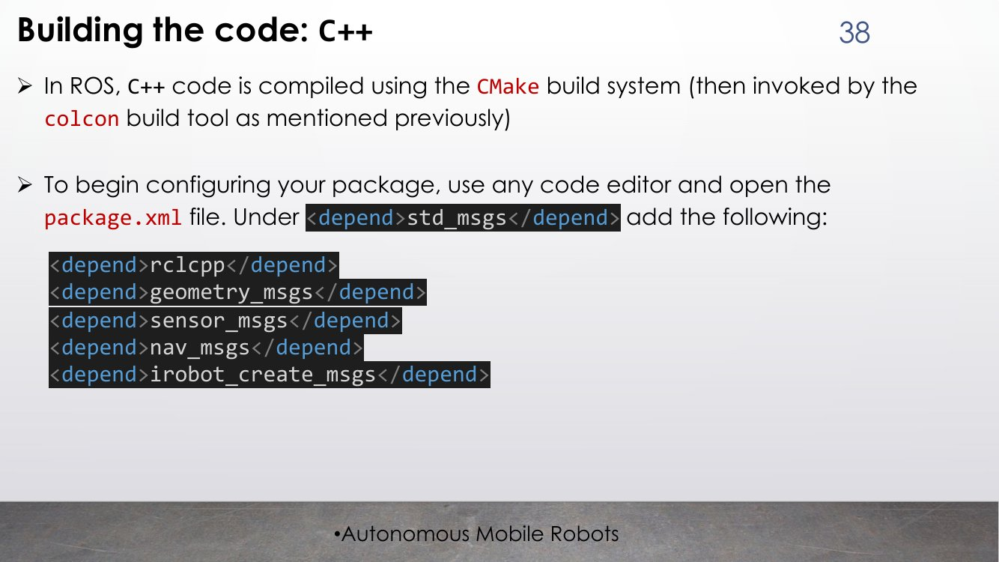

<details>
<summary>Extracted text</summary>

```text
Building the code: C++
38
Ø In ROS, C++ code is compiled using the CMake build system (then invoked by the
colcon build tool as mentioned previously)
Ø To begin configuring your package, use any code editor and open the
package.xml file. Under <depend>std_msgs</depend> add the following:
<depend>rclcpp</depend>
<depend>geometry_msgs</depend>
<depend>sensor_msgs</depend>
<depend>nav_msgs</depend>
<depend>irobot_create_msgs</depend>
•Autonomous Mobile Robots
```

</details>

<a id="page-39"></a>
## Page 39

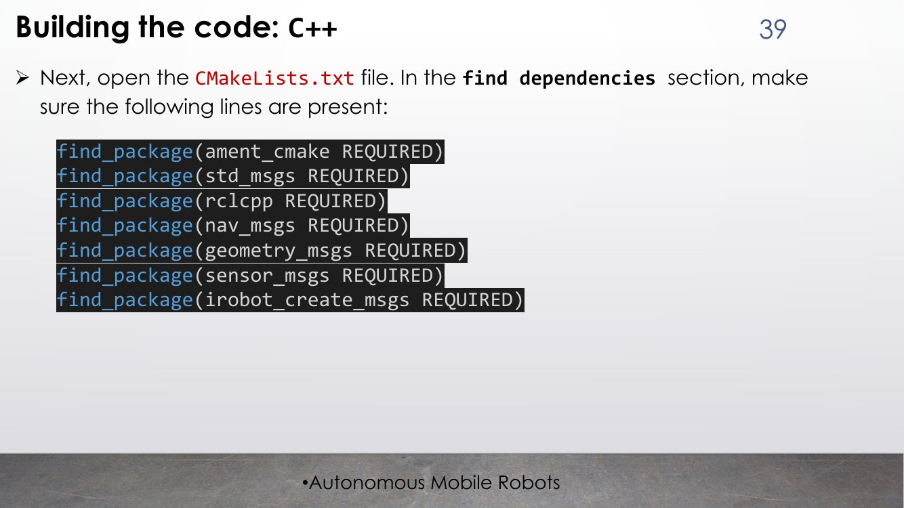

<details>
<summary>Extracted text</summary>

```text
Building the code: C++
39
Ø Next, open the CMakeLists.txt file. In the find dependencies section, make
sure the following lines are present:
find_package(ament_cmake REQUIRED)
find_package(std_msgs REQUIRED)
find_package(rclcpp REQUIRED)
find_package(nav_msgs REQUIRED)
find_package(geometry_msgs REQUIRED)
find_package(sensor_msgs REQUIRED)
find_package(irobot_create_msgs REQUIRED)
•Autonomous Mobile Robots
```

</details>

<a id="page-40"></a>
## Page 40

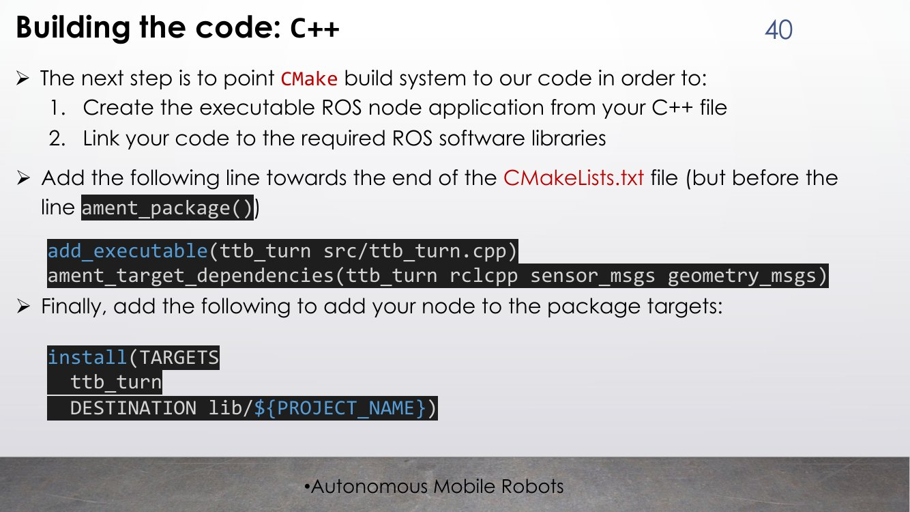

<details>
<summary>Extracted text</summary>

```text
Building the code: C++
40
Ø The next step is to point CMake build system to our code in order to:
1. Create the executable ROS node application from your C++ file
2. Link your code to the required ROS software libraries
Ø Add the following line towards the end of the CMakeLists.txt file (but before the
line ament_package())
add_executable(ttb_turn src/ttb_turn.cpp)
ament_target_dependencies(ttb_turn rclcpp sensor_msgs geometry_msgs)
Ø Finally, add the following to add your node to the package targets:
install(TARGETS
ttb_turn
DESTINATION lib/${PROJECT_NAME})
•Autonomous Mobile Robots
```

</details>

<a id="page-41"></a>
## Page 41

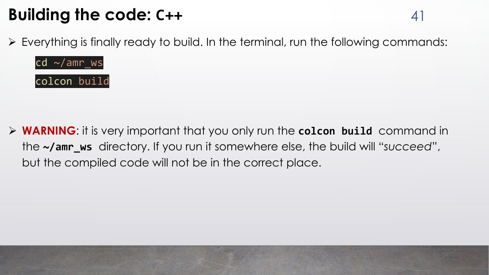

<details>
<summary>Extracted text</summary>

```text
Building the code: C++
41
Ø Everything is finally ready to build. In the terminal, run the following commands:
cd ~/amr_ws
colcon build
Ø WARNING: it is very important that you only run the colcon build command in
the ~/amr_ws directory. If you run it somewhere else, the build will “succeed”,
but the compiled code will not be in the correct place.
```

</details>

<a id="page-42"></a>
## Page 42

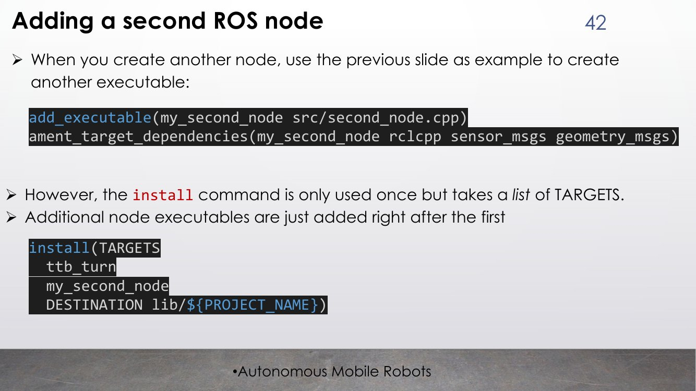

<details>
<summary>Extracted text</summary>

```text
Adding a second ROS node
42
Ø When you create another node, use the previous slide as example to create
another executable:
add_executable(my_second_node src/second_node.cpp)
ament_target_dependencies(my_second_node rclcpp sensor_msgs geometry_msgs)
Ø However, the install command is only used once but takes a list of TARGETS.
Ø Additional node executables are just added right after the first
install(TARGETS
ttb_turn
my_second_node
DESTINATION lib/${PROJECT_NAME})
•Autonomous Mobile Robots
```

</details>

<a id="page-43"></a>
## Page 43

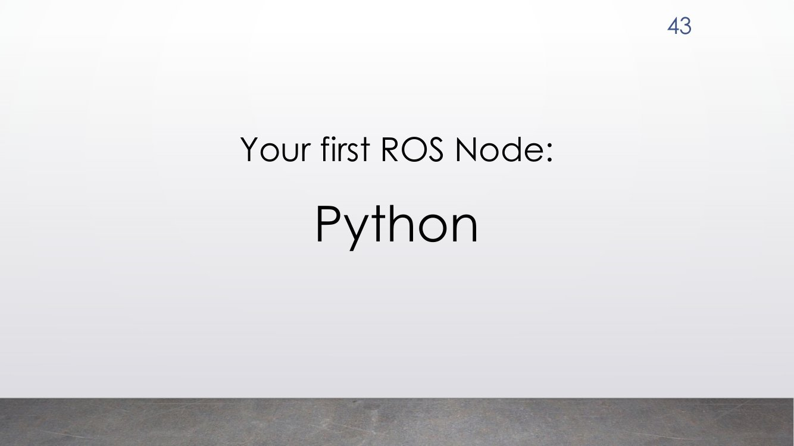

<details>
<summary>Extracted text</summary>

```text
43
Your first ROS Node:
Python
```

</details>

<a id="page-44"></a>
## Page 44

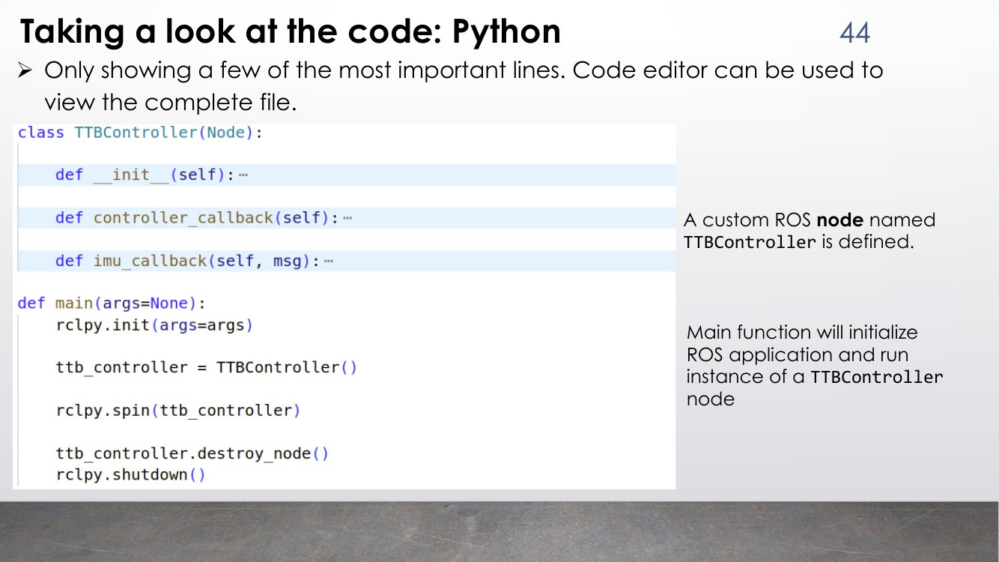

<details>
<summary>Extracted text</summary>

```text
Taking a look at the code: Python
44
Ø Only showing a few of the most important lines. Code editor can be used to
view the complete file.
A custom ROS node named
TTBController is defined.
Main function will initialize
ROS application and run
instance of a TTBController
node
```

</details>

<a id="page-45"></a>
## Page 45

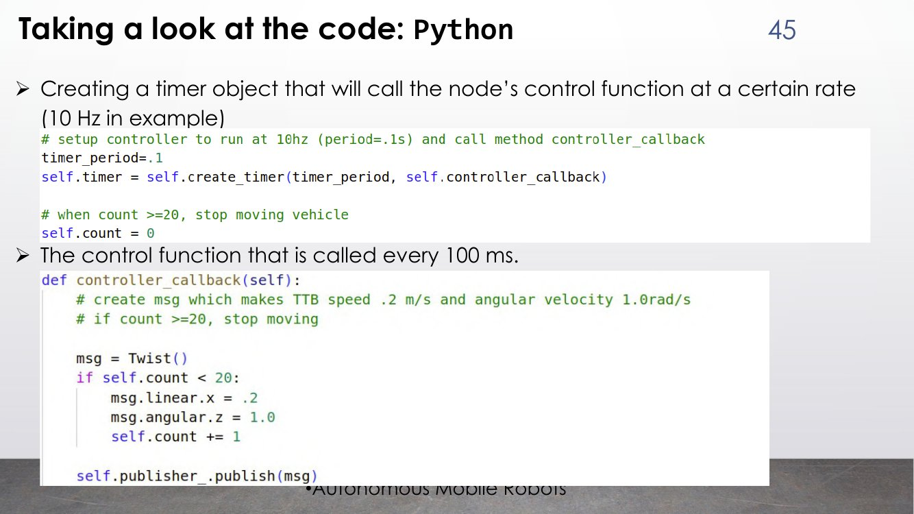

<details>
<summary>Extracted text</summary>

```text
Taking a look at the code: Python 45
Ø Creating a timer object that will call the node’s control function at a certain rate
(10 Hz in example)
Ø The control function that is called every 100 ms.
•Autonomous Mobile Robots
```

</details>

<a id="page-46"></a>
## Page 46

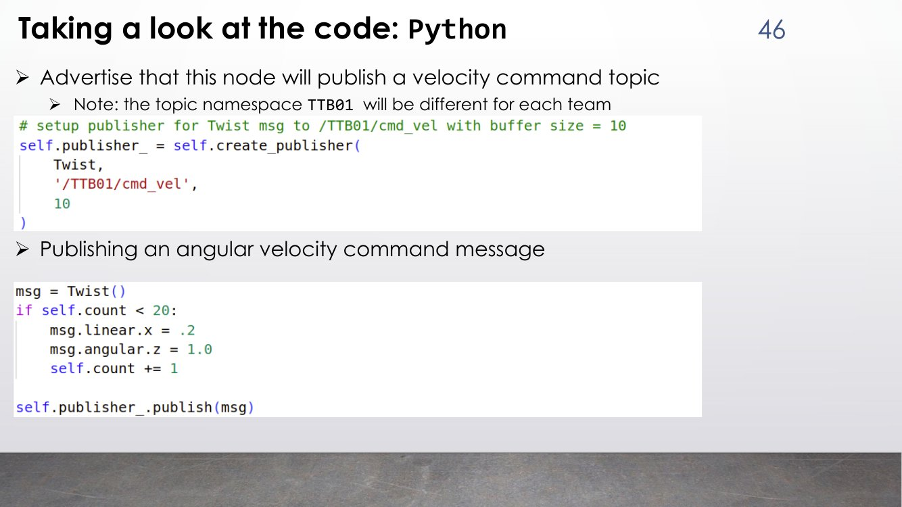

<details>
<summary>Extracted text</summary>

```text
Taking a look at the code: Python 46
Ø Advertise that this node will publish a velocity command topic
Ø Note: the topic namespace TTB01 will be different for each team
Ø Publishing an angular velocity command message
```

</details>

<a id="page-47"></a>
## Page 47

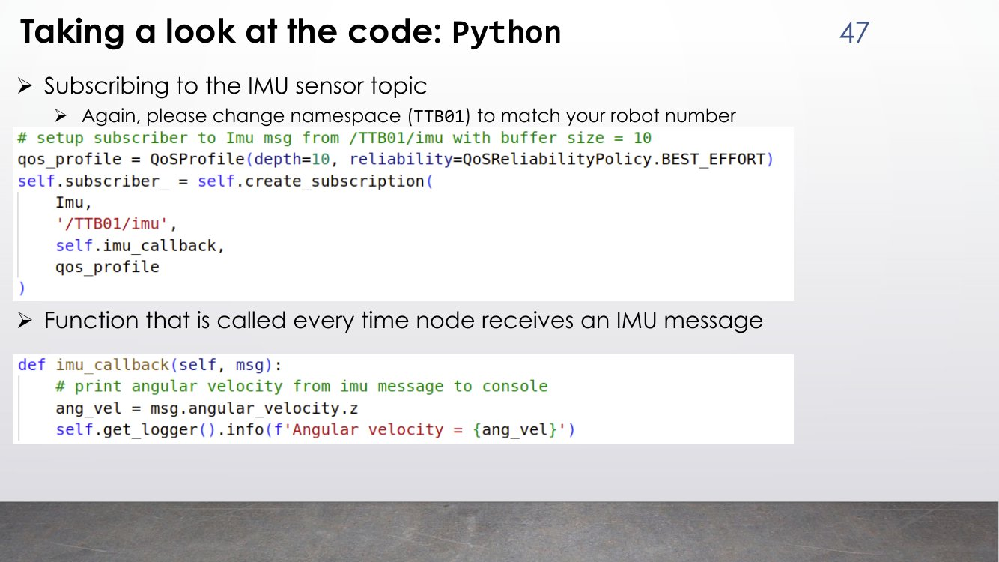

<details>
<summary>Extracted text</summary>

```text
Taking a look at the code: Python 47
Ø Subscribing to the IMU sensor topic
Ø Again, please change namespace (TTB01) to match your robot number
Ø Function that is called every time node receives an IMU message
```

</details>

<a id="page-48"></a>
## Page 48

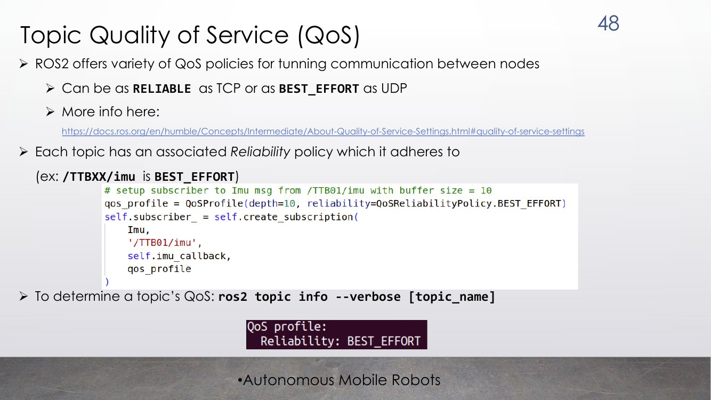

<details>
<summary>Extracted text</summary>

```text
48
Topic Quality of Service (QoS)
Ø ROS2 offers variety of QoS policies for tunning communication between nodes
Ø Can be as RELIABLE as TCP or as BEST_EFFORT as UDP
Ø More info here:
https://docs.ros.org/en/humble/Concepts/Intermediate/About-Quality-of-Service-Settings.html#quality-of-service-settings
Ø Each topic has an associated Reliability policy which it adheres to
(ex: /TTBXX/imu is BEST_EFFORT)
Ø To determine a topic’s QoS: ros2 topic info --verbose [topic_name]
•Autonomous Mobile Robots
```

</details>

<a id="page-49"></a>
## Page 49

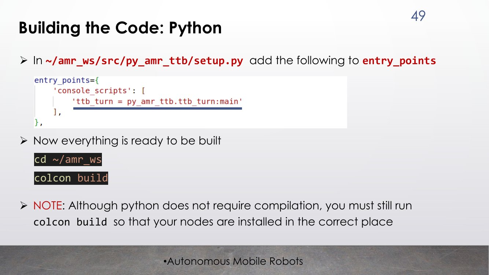

<details>
<summary>Extracted text</summary>

```text
49
Building the Code: Python
Ø In ~/amr_ws/src/py_amr_ttb/setup.py add the following to entry_points
Ø Now everything is ready to be built
cd ~/amr_ws
colcon build
Ø NOTE: Although python does not require compilation, you must still run
colcon build so that your nodes are installed in the correct place
•Autonomous Mobile Robots
```

</details>

<a id="page-50"></a>
## Page 50


<details>
<summary>Extracted text</summary>

```text
50
Launch Files
```

</details>

<a id="page-51"></a>
## Page 51

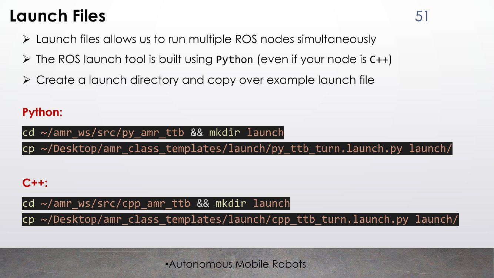

<details>
<summary>Extracted text</summary>

```text
Launch Files 51
Ø Launch files allows us to run multiple ROS nodes simultaneously
Ø The ROS launch tool is built using Python (even if your node is C++)
Ø Create a launch directory and copy over example launch file
Python:
cd ~/amr_ws/src/py_amr_ttb && mkdir launch
cp ~/Desktop/amr_class_templates/launch/py_ttb_turn.launch.py launch/
C++:
cd ~/amr_ws/src/cpp_amr_ttb && mkdir launch
cp ~/Desktop/amr_class_templates/launch/cpp_ttb_turn.launch.py launch/
•Autonomous Mobile Robots
```

</details>

<a id="page-52"></a>
## Page 52

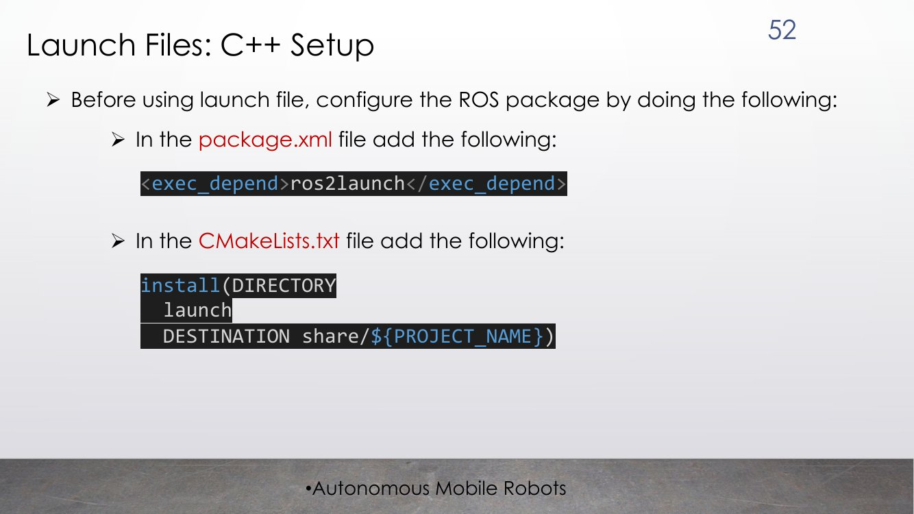

<details>
<summary>Extracted text</summary>

```text
52
Launch Files: C++ Setup
Ø Before using launch file, configure the ROS package by doing the following:
Ø In the package.xml file add the following:
<exec_depend>ros2launch</exec_depend>
Ø In the CMakeLists.txt file add the following:
install(DIRECTORY
launch
DESTINATION share/${PROJECT_NAME})
•Autonomous Mobile Robots
```

</details>

<a id="page-53"></a>
## Page 53

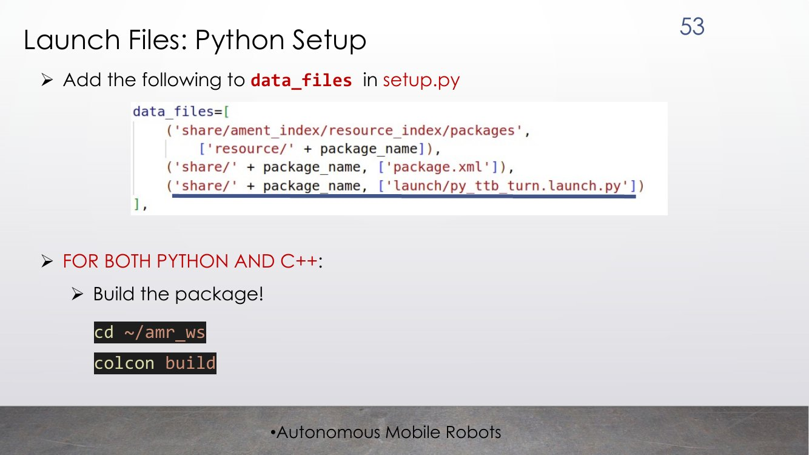

<details>
<summary>Extracted text</summary>

```text
53
Launch Files: Python Setup
Ø Add the following to data_files in setup.py
Ø FOR BOTH PYTHON AND C++:
Ø Build the package!
cd ~/amr_ws
colcon build
•Autonomous Mobile Robots
```

</details>

<a id="page-54"></a>
## Page 54

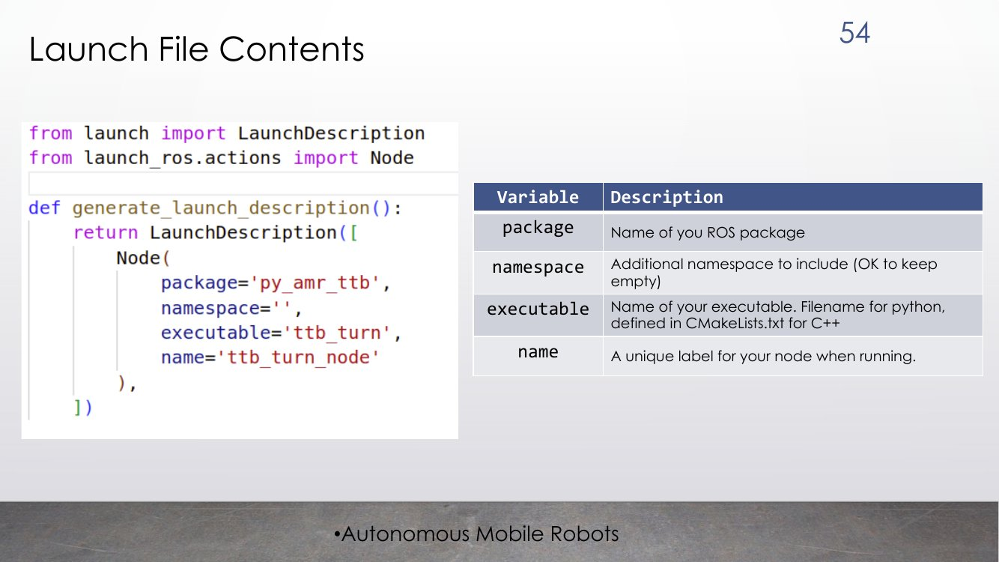

<details>
<summary>Extracted text</summary>

```text
54
Launch File Contents
Variable Description
package
Name of you ROS package
namespace Additional namespace to include (OK to keep
empty)
executable Name of your executable. Filename for python,
defined in CMakeLists.txt for C++
name
A unique label for your node when running.
•Autonomous Mobile Robots
```

</details>

<a id="page-55"></a>
## Page 55

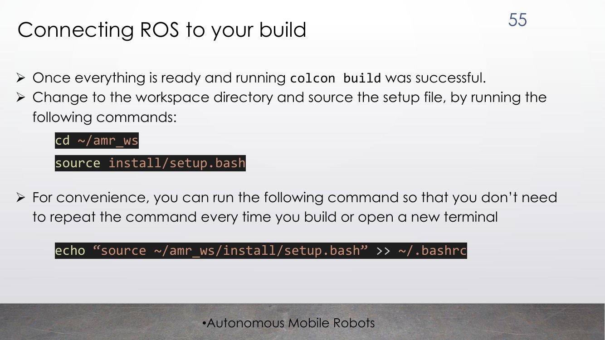

<details>
<summary>Extracted text</summary>

```text
55
Connecting ROS to your build
Ø Once everything is ready and running colcon build was successful.
Ø Change to the workspace directory and source the setup file, by running the
following commands:
cd ~/amr_ws
source install/setup.bash
Ø For convenience, you can run the following command so that you don’t need
to repeat the command every time you build or open a new terminal
echo “source ~/amr_ws/install/setup.bash” >> ~/.bashrc
•Autonomous Mobile Robots
```

</details>

<a id="page-56"></a>
## Page 56

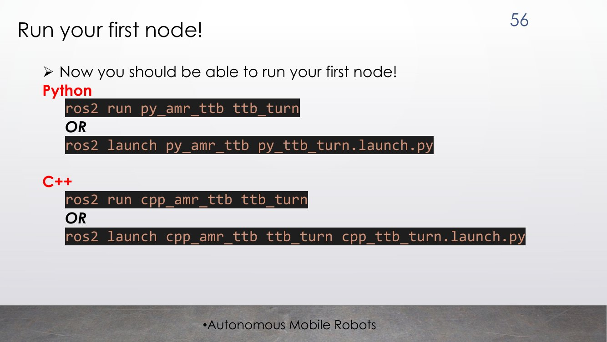

<details>
<summary>Extracted text</summary>

```text
56
Run your first node!
Ø Now you should be able to run your first node!
Python
ros2 run py_amr_ttb ttb_turn
OR
ros2 launch py_amr_ttb py_ttb_turn.launch.py
C++
ros2 run cpp_amr_ttb ttb_turn
OR
ros2 launch cpp_amr_ttb ttb_turn cpp_ttb_turn.launch.py
•Autonomous Mobile Robots
```

</details>

<a id="page-57"></a>
## Page 57

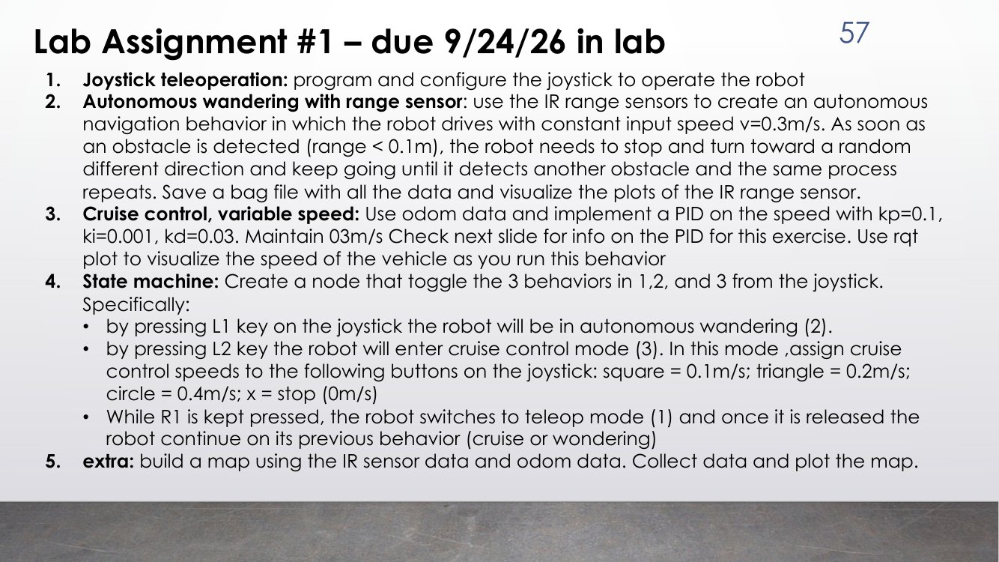

<details>
<summary>Extracted text</summary>

```text
57
Lab Assignment #1 – due 9/24/26 in lab
1. Joystick teleoperation: program and configure the joystick to operate the robot
2. Autonomous wandering with range sensor: use the IR range sensors to create an autonomous
navigation behavior in which the robot drives with constant input speed v=0.3m/s. As soon as
an obstacle is detected (range < 0.1m), the robot needs to stop and turn toward a random
different direction and keep going until it detects another obstacle and the same process
repeats. Save a bag file with all the data and visualize the plots of the IR range sensor.
3. Cruise control, variable speed: Use odom data and implement a PID on the speed with kp=0.1,
ki=0.001, kd=0.03. Maintain 03m/s Check next slide for info on the PID for this exercise. Use rqt
plot to visualize the speed of the vehicle as you run this behavior
4. State machine: Create a node that toggle the 3 behaviors in 1,2, and 3 from the joystick.
Specifically:
• by pressing L1 key on the joystick the robot will be in autonomous wandering (2).
• by pressing L2 key the robot will enter cruise control mode (3). In this mode ,assign cruise
control speeds to the following buttons on the joystick: square = 0.1m/s; triangle = 0.2m/s;
circle = 0.4m/s; x = stop (0m/s)
• While R1 is kept pressed, the robot switches to teleop mode (1) and once it is released the
robot continue on its previous behavior (cruise or wondering)
5. extra: build a map using the IR sensor data and odom data. Collect data and plot the map.
```

</details>

<a id="page-58"></a>
## Page 58

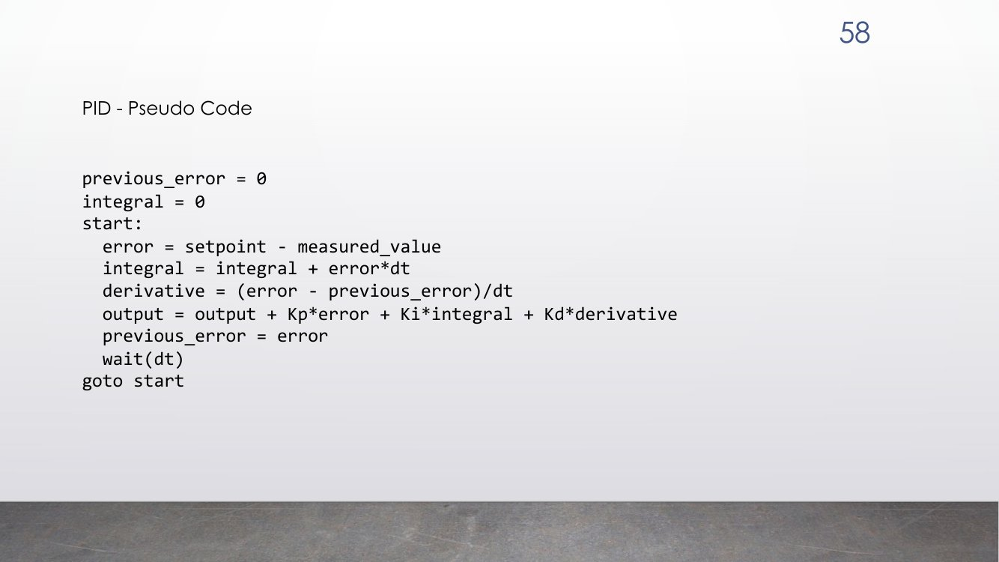

<details>
<summary>Extracted text</summary>

```text
58
PID - Pseudo Code
previous_error = 0
integral = 0
start:
error = setpoint - measured_value
integral = integral + error*dt
derivative = (error - previous_error)/dt
output = output + Kp*error + Ki*integral + Kd*derivative
previous_error = error
wait(dt)
goto start
```

</details>

<a id="page-59"></a>
## Page 59

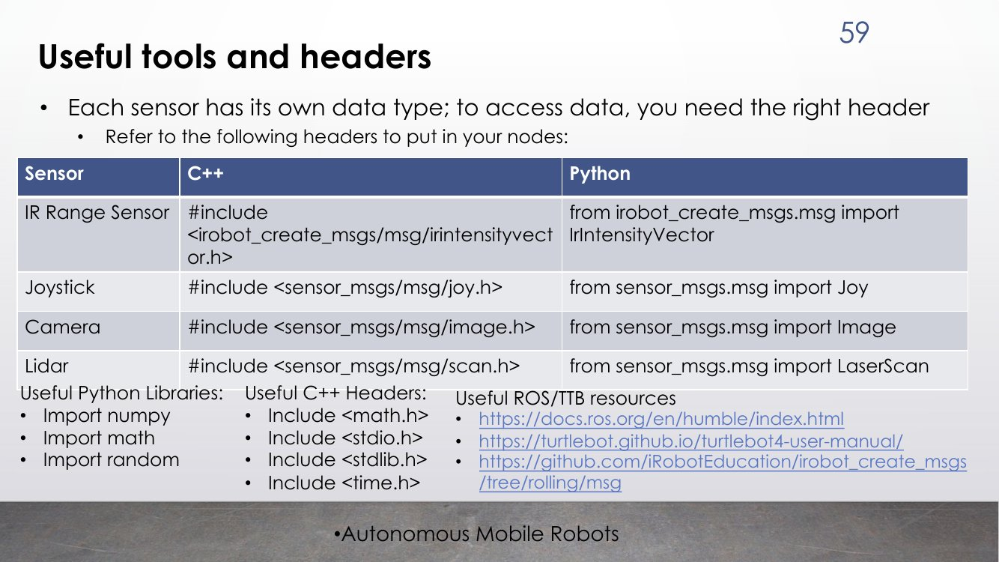

<details>
<summary>Extracted text</summary>

```text
59
Useful tools and headers
• Each sensor has its own data type; to access data, you need the right header
• Refer to the following headers to put in your nodes:
Sensor C++ Python
IR Range Sensor #include from irobot_create_msgs.msg import
<irobot_create_msgs/msg/irintensityvect IrIntensityVector
or.h>
Joystick #include <sensor_msgs/msg/joy.h> from sensor_msgs.msg import Joy
Camera #include <sensor_msgs/msg/image.h> from sensor_msgs.msg import Image
Lidar #include <sensor_msgs/msg/scan.h> from sensor_msgs.msg import LaserScan
Useful Python Libraries: Useful C++ Headers:
Useful ROS/TTB resources
• Import numpy • Include <math.h>
• https://docs.ros.org/en/humble/index.html
• Import math • Include <stdio.h>
• https://turtlebot.github.io/turtlebot4-user-manual/
• Import random • Include <stdlib.h> • https://github.com/iRobotEducation/irobot_create_msgs
• Include <time.h> /tree/rolling/msg
•Autonomous Mobile Robots
```

</details>
